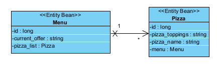

# Maddness Event

MadnessEvents is a dynamic and specialized organization in the planning of techno and rave events across Switzerland, for its own high energy and quick growing community. To expand its reach across young people and strengthen the involvement of its audience, MadnessEvents decided to release its own brand-new website. This platform is planned to be the main destination where customers can easily buy tickets for future upcoming events, buy the exclusive branded merchandise, and receive news about the future events, all these features in a unified digital space that reflects the unique and vibrant identity of the brand. 
The aim of the creation of a web shop is then to satisfy those needs, giving MadnessEvents the full control upon its business and on the brand representation towards the full user experience. Furthermore, the techno and rave industry represents a promising market opportunity, with a growing demand of memorable and impactful experiences and exclusive branded merchandise, related to the continuous growth of the business since 2020. The web shop will then exploit this opportunity, not only by facilitating tickets sales, but also by offering limited editions merchandise items, to capture the unique atmosphere of each event and performer. The website will also represent essential details like DJs’ background and information, the specifics of the venue, the activities in program, and finally a full monthly schedule. The website will be optimized to handle the peaks of users traffic, especially during the release of either tickets or merchandise, and will be characterized by a vibrant and attractive techno-themed interface. As the community will keep on growing in number, this platform has the potential to grow with it, by integrating new functionalities like the sales of early access privileges, exclusive content, and loyalty rewards.


#### Contents:
- [Analysis](#analysis)
  - [Project Analysis](#project-analysis)
  - [Scenario](#scenario)
  - [User Stories](#user-stories)
  - [Use Case](#use-case)
- [Design](#design)
  - [Prototype Design](#prototype-design)
  - [Domain Design](#domain-design)
  - [Business Logic](#business-logic)
- [Implementation](#implementation)
  - [Backend Technology](#backend-technology)
  - [Frontend Technology](#frontend-technology)
- [Project Management](#project-management)
  - [Roles](#roles)
  - [Milestones](#milestones)

## Analysis
> 🚧: You can reuse the analysis (you made) from other projects (e.g., requirement engineering), but it must be submitted according to the following template. 


### Project Analysis

MadnessEvent operates in a market where audience attention is strongly influenced by visual identity, speed of access to information, and ease of purchase. The website must therefore do more than present static information. It has to support the brand commercially and communicate the event experience clearly enough that users can move from discovery to purchase without friction.

The current business need is a single digital platform that combines event visibility, brand storytelling, and commercial interaction. At present, a fragmented flow would force users to search for event details, tickets, merchandise, and updates across multiple channels. This increases the risk of lost sales, inconsistent information, and weaker brand control.

The analysis identifies three main requirements for the planned website:

- It must present upcoming events clearly, with enough detail for users to decide whether they want to attend.
- It must support a commercial journey where users can buy tickets and branded merchandise in a structured and trustworthy way.
- It must reflect the visual identity of MadnessEvent through a consistent techno-inspired interface that differentiates the brand from generic event websites.

From a user perspective, the most important quality attributes are usability, mobile responsiveness, visual consistency, and clear navigation. From a business perspective, the most important goals are stronger brand positioning, direct customer reach, and support for ticket and merchandise sales.

This makes the website a business platform, not only a promotional page. The early design work therefore has to validate both the structure of the content and the logic of the main user journeys before implementation starts.

### Scenario

MadnessEvent is a growing organizer of techno and rave events in Switzerland. As its audience expands, the organization needs a dedicated website that acts as the main entry point for customers, followers, and potential buyers. The website should allow visitors to discover future events, understand the lineup and venue details, explore official merchandise, and engage with the brand in a coherent online environment.

The problem today is that users do not have one structured platform where all relevant information and purchase options are available together. Event communication, product promotion, and brand presentation are harder to manage when they are spread across separate channels. This weakens the customer journey and limits the organization's control over how its brand is experienced.

The proposed solution is a web platform that brings together event discovery, event detail pages, ticket purchase paths, merchandise browsing, and general brand information. The website should work on mobile and desktop devices and should be designed for periods of high traffic, especially when new tickets or limited products are released.

The scenario assumes a target audience of young, digitally active users who expect fast access to information, visually engaging design, and smooth navigation. The website must therefore emphasize strong first impressions, clear content hierarchy, and direct calls to action such as viewing event details, buying tickets, or browsing merchandise.

In later phases, the platform can evolve with more advanced features such as account-based services, loyalty rewards, premium access, or exclusive digital content. For the current milestone, the scenario defines the business context and user environment that guide the prototype.

### User Stories
1. As an Admin, I want to create, update, and modify event and ticket information, so that users always see accurate event details and ticket availability. 
2. As an Admin, I want to update and manage merchandise information on the website, so that users can view and purchase the correct products. 
3. As an Admin, I want to generate reports about user activity on the website, so that I can analyze customer behavior. 
4. As an Admin, I want to export reports about user activity on the website, so that I can use the data for business analysis and decision-making. 
5. As a Visitor, I want to create an account on the website, so that I can purchase tickets, buy merchandise, and follow upcoming events. 
6. As a registered user, I want to log in to my account so that I can access my personal information and make purchases. 
7. As a User, I want to view information about upcoming events and available tickets, so that I can decide which event I want to attend. 
8. As a user, I want to browse merchandise such as accessories, clothing, and limited-edition items, so that I can buy products related to events. 
9. As a user, I want to search for merchandise using keywords, so that I can quickly find specific products I am interested in. 
10. As a user, I want to add, remove, or update items in my shopping cart, so that I can control the products and quantities before purchasing. 
11. As a user, I want to complete the purchase of tickets or merchandise from my cart, so that I can attend events and receive my selected products. 
12. As a user, I want to subscribe to the MadnessEvents newsletter, so that I can receive updates about upcoming events and new merchandise. 

### Use Case

- UC-1 [View events ] User can see detailed information about a specific event (date, venue, DJ, price) 
- UC-2 [Purchase tickets] User can buy tickets for an event through the website 
- UC-3 [Create new event] Admin can create a new event with all details (date, DJ, venue, price) 
- UC-4 [Download e-ticket] User can download e-tickets directly after payment 
- UC-5 [Browse all products] User can view all merchandise item on website 
- UC-6 [View product details ] User can see specific product information (price, image, size, color, description) 
- UC-7 [Add product to cart] User can select product and add to shopping cart 
- UC-8 [Create new product] Admin can create a new merchandise item to the online shop 
- UC-9 [View order history] User can see their past purchases and order status 
- UC-10 [Process order] User can complete purchase through checkout

## Design
> 🚧: Keep in mind the Corporate Identity (CI); you shall decide appropriately the color schema, graphics, typography, layout, User Experience (UX), and so on.

### Wireframe
> 🚧: It is suggested to start with a wireframe. The wireframe focuses on the website structure (Sitemap planning), sketching the pages using Wireframe components (e.g., header, menu, footer) and UX. You can create a wireframe already with draw.io or similar tools. 

Starting from the home page, we can visit different pages. Available public pages are visible in the menu...

### Prototype

The prototype is intended to validate the page structure, navigation flow, and main user journey before backend development. At this stage, realistic placeholder data is sufficient. The prototype does not need live integration, but it should clearly show how a visitor moves through the MadnessEvent website.

The prototype should use a consistent navigation bar on all main pages. The navigation should include:

- `Homepage`
- `DJs`
- `Tickets`
- `Shop`

The prototype should include these main screens:

1. `Homepage`: The homepage is the entry point of the website. It should welcome users to MadnessEvent, show the newest upcoming event, include a strong event photo, and provide a clear `Book ticket here!` action. From this page, users should be able to navigate directly to DJs, tickets, and the shop.
2. `DJs page`: The DJs page should present a list of DJs. Each DJ entry should lead to DJ information, so visitors can learn more about the performers connected to the events.
3. `Tickets page`: The tickets page should show the upcoming events. Each event card should include a photo, date, location, DJ, number of tickets available, and price. This page supports the main ticket discovery and booking flow.
4. `Login page`: The login page should allow returning or registered users to access their account. In the prototype, this page can be represented with a simple login form and does not need a working authentication system yet.
5. `Shop page`: The shop page should present MadnessEvent merchandise. It should include product categories such as apparel and accessories. Apparel examples include T-shirts, hoodies, hats, headwear, and tank tops. Accessory examples include branded hats, wristbands, stickers, and lighters. Product cards should show a photo, description, color, size, and price.

Each main page should also include a footer with `Contact us`, `FAQs`, and social media links. This keeps the user journey consistent and gives visitors access to basic support and communication options from every page.

The prototype should validate these flows:

- User enters the homepage and sees the newest upcoming event.
- User uses the navigation bar to move between homepage, DJs, tickets, and shop.
- User opens the DJs page and views DJ information.
- User opens the tickets page and compares event details before booking.
- User uses the booking action to move toward ticket purchase.
- User opens the login page when account access is required.
- User browses the shop and compares merchandise by category, description, size, color, and price.

The design direction should follow a dark, high-contrast, club-inspired visual language with strong typography and image-led sections. This matches the techno and rave identity of MadnessEvent and makes the prototype useful for testing both navigation and brand presentation.

### Domain Design
> 🚧: Provide a picture and describe your domain model; you may use Entity-Relationship Model or UML class diagram. Both can be created in Visual Paradigm - we have an academic license for it.

The `ch.fhnw.pizza.data.domain` package contains the following domain objects / entities including getters and setters:



### Business Logic 
> 🚧: Describe the business logic for **at least one business service** in detail. If available, show the expected path and HTPP method. The remaining documentation of APIs shall be made available in the swagger endpoint. The default Swagger UI page is available at /swagger-ui.html.

Based on the UC-4, there will be two offers and a standard offer. Given a location, a message is shown accordingly:

- If the location is "Basel", the message is "10% off on all large pizzas!!!"
- If the location is "Brugg", the message is "two for the price of One on all small pizzas!!!"
- Otherwise, the message is "No special offer".

**Path**: [`/api/menu/?location="Basel"`] 

**Param**: `value="location"` Admitted value: "Basel","Brugg".

**Method:** `GET`

## Implementation
> 🚧: Briefly describe your technology stack, which apps were used and for what.

### Backend Technology
> 🚧: It is suggested to clone this repository, but you are free to start from fresh with a Spring Initializr. If so, describe if there are any changes to the PizzaRP e.g., different dependencies, versions & etc... Please, also describe how your database is set up. If you want a persistent or in-memory H2 database check [link](https://github.com/FHNW-INT/Pizzeria_Reference_Project/blob/main/pizza/src/main/resources/application.properties). If you have placeholder data to initialize at the app, you may use a variation of the method **initPlaceholderData()** available at [link](https://github.com/FHNW-INT/Pizzeria_Reference_Project/blob/main/pizza/src/main/java/ch/fhnw/pizza/PizzaApplication.java).

This Web application is relying on [Spring Boot](https://projects.spring.io/spring-boot) and the following dependencies:

- [Spring Boot](https://projects.spring.io/spring-boot)
- [Spring Data](https://projects.spring.io/spring-data)
- [Java Persistence API (JPA)](http://www.oracle.com/technetwork/java/javaee/tech/persistence-jsp-140049.html)
- [H2 Database Engine](https://www.h2database.com)

To bootstrap the application, the [Spring Initializr](https://start.spring.io/) has been used.

Then, the following further dependencies have been added to the project `pom.xml`:

- DB:
```XML
<dependency>
			<groupId>com.h2database</groupId>
			<artifactId>h2</artifactId>
			<scope>runtime</scope>
</dependency>
```

- SWAGGER:
```XML
   <dependency>
      <groupId>org.springdoc</groupId>
      <artifactId>springdoc-openapi-starter-webmvc-ui</artifactId>
      <version>2.3.0</version>
   </dependency>
```

### Frontend Technology
> 🚧: Describe your views and what APIs is used on which view. If you don't have access to the Internet Technology class Budibase environment(https://inttech.budibase.app/), please write to Devid on MS teams.

This Web application was developed using Budibase and it is available for preview at https://inttech.budibase.app/app/pizzeria. 

## Execution
> 🚧: Please describe how to execute your app and what configurations must be changed to run it. 

**The codespace URL of this Repo is subject to change.** Therefore, the Budibase PizzaRP webapp is not going to show any data in the view, when the URL is not updated or the codespace is offline. Follow these steps to start the webservice and reconnect the webapp to the new webservice url. 

> 🚧: This is a shortened description for example purposes. A complete tutorial will be provided in a dedicated lecture.

1. Clone PizzaRP in a new repository.
2. Start your codespace (see video guide at: [link](https://www.youtube.com/watch?v=_W9B7qc9lVc&ab_channel=GitHub))
3. Run the PizzaRP main available at PizzaApplication.java on your own codespace.
4. Set your app with a public port, see the guide at [link](https://docs.github.com/en/codespaces/developing-in-a-codespace/forwarding-ports-in-your-codespace).
5. Create an own Budibase app, you can export/import the existing Pizzeria app. Guide available at [link](https://docs.budibase.com/docs/export-and-import-apps).
6. Update the pizzeria URL in the datasource and publish your app.

### Deployment to a PaaS
> 🚧: Deployment to PaaS is optional but recommended as it will make your application (backend) accessible without server restart and through a unique, constantly available link.  

Alternatively, you can deploy your application to a free PaaS like [Render](https://dashboard.render.com/register).
1. Refer to the Dockerfile inside the application root (FHNW-INT/Pizzeria_Reference_Project/pizza).
2. Adapt line 13 to the name of your jar file. The jar name should be derived from the details in the pom.xml as follows:<br>
`{artifactId}-{version}.jar` 
2. Login to Render using your GitHub credentials.
3. Create a new Web Service and choose Build and deploy from a Git repository.
4. Enter the link to your (public) GitHub repository and click Continue.
5. Enter the Root Directory (name of the folder where pom.xml resides).
6. Choose the Instance Type as Free/Hobby. All other details are default.
7. Click on Create Web Service. Your app will undergo automatic build and deployment. Monitor the logs to view the progress or error messages. The entire process of Build+Deploy might take several minutes.
8. After successful deployment, you can access your backend using the generated unique URL (visible on top left under the name of your web service).
9. This unique URL will remain unchanged as long as your web service is deployed on Render. You can now integrate it in Budibase to make API calls to your custom endpoints.

## Project Management
> 🚧: Include all the participants and briefly describe each of their **individual** contribution and/or roles. Screenshots/descriptions of your Kanban board or similar project management tools are welcome.

### Roles
- Back-end developer: Charuta Pande 
- Front-end developer: Devid Montecchiari

### Milestones
1. **Analysis**: Scenario ideation, use case analysis and user story writing.
2. **Prototype Design**: Creation of wireframe and prototype.
3. **Domain Design**: Definition of domain model.
4. **Business Logic and API Design**: Definition of business logic and API.
5. **Data and API Implementation**: Implementation of data access and business logic layers, and API.
6. **Security and Frontend Implementation**: Integration of security framework and frontend realisation.
7. (optional) **Deployment**: Deployment of Web application on cloud infrastructure.


#### Maintainer
- Charuta Pande
- Devid Montecchiari

#### License
- [Apache License, Version 2.0](blob/master/LICENSE)

Backend Technology
The backend of the MadnessEvents application is based on Spring Boot and was initialized by adapting the provided reference project.
The application currently uses the following technologies and dependencies:

- Spring Boot
- Spring Data JPA
- H2 Database Engine
- Spring Web
- Spring Security
- OpenAPI / Swagger

For the initial backend setup, the reference structure was reused and adapted to the MadnessEvents project. The package structure and application naming were updated to match the new project domain.
The backend was successfully tested in GitHub Codespaces and runs on port 8080.
Database Setup
The application uses an H2 database for development and testing purposes. Placeholder data is initialized during startup to simplify testing of the backend without requiring manual data insertion.

Notes
At this stage, the backend setup provides the technical foundation for the next milestones, including implementation of web services, authentication, and integration with the frontend.


